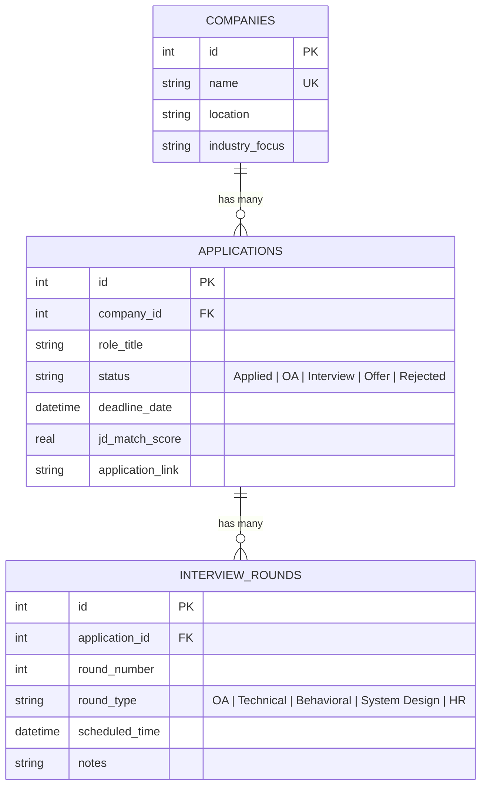

<div align="center">

# 🎯 Adit's Placement Portal

**An AI-powered, full-stack placement tracking system built with Flask, SQLite, PostgreSQL, and Google Gemini API.**

[](https://python.org)
[](https://flask.palletsprojects.com)
[](https://ai.google.dev)
[](https://postgresql.org)
[](https://sqlite.org)
[](https://tailwindcss.com)
[](LICENSE)
[](https://render.com)

---

*Track applications, analyze job descriptions with AI, auto-parse recruiter emails, and build professional resumes — all from one brutalist dashboard.*

</div>

---

## ✨ Features

### 📊 Smart Dashboard
Real-time overview with dynamic stat cards — total applications, active interviews, offers received, and a 48-hour critical deadline alert banner powered by a background scheduler thread.

### 📋 Application Tracker (Full CRUD)
Add, edit, and delete job applications with company auto-registration. Each application card includes an inline **Interview Stage Funnel** to track multi-round recruitment pipelines (OA → Technical → Behavioral → HR → Offer).

### 🧠 Gemini AI Job Matcher
Paste your resume and a job description side-by-side. The AI returns a **compatibility score**, matched skills, missing keywords, and actionable resume improvement tips — all via `gemini-2.5-flash` with deterministic `temperature=0.0` scoring. Scores automatically sync back to your application tracker.

### 📄 Resume Builder & PDF/LaTeX Compiler
Write or import your resume (`.pdf` / `.txt`), and compile it into:
- A **Harvard-standard professional PDF** (generated locally via FPDF2)
- A **clean, compilable LaTeX `.tex` file**

Both are downloadable in one click. The resume text also auto-syncs as the default for the AI Matcher.

### ⚡ AI Fast Register (Email & Screenshot Parser)
Upload a recruiter email **screenshot** or paste the email body text. Gemini's multimodal vision extracts:
- Company, role, status, deadlines, and interview schedules
- Auto-matches against existing applications in your database
- Pre-populates a verification form for one-click registration

### 🔔 48-Hour Background Alert Engine
An independent daemon thread scans the database every 60 seconds. When deadlines or interviews fall within 48 hours, it:
- Prints color-coded ASCII alert blocks in the terminal
- Displays a persistent red warning banner across the web UI

---

## 🏗️ Tech Stack

| Layer | Technology |
|-------|-----------|
| **Backend** | Python 3.11 · Flask 3.0 |
| **Database** | Hybrid SQLite 3 (offline dev) & PostgreSQL (Neon Cloud DB in production) |
| **AI Engine** | Google Gemini 2.5 Flash (text + multimodal vision) |
| **PDF Generation** | FPDF2 (Harvard-standard resume layout) |
| **PDF Parsing** | pypdf (resume file import & text extraction) |
| **Frontend** | Jinja2 · Tailwind CSS (CDN) · Material Symbols |
| **Typography** | Space Grotesk (headlines) · Inter (body) |
| **Deployment** | Render · Gunicorn WSGI |
| **Design System** | Neo-Brutalist — thick borders, offset shadows, high-contrast flat colors |

---

## 📐 Database Schema



All tables enforce `ON DELETE CASCADE` for referential integrity.

---

## 📂 Project Structure

```
placement-portal/
├── app.py                  # Flask app — routes, Gemini API, background scheduler
├── db.py                   # SQLite connection manager & CRUD helpers
├── pdf_generator.py        # FPDF2 Harvard-standard PDF resume builder
├── schema.sql              # Database table definitions
├── seed.sql                # Demo seed data (Google, Meta, Stripe, Vercel)
├── resume.txt              # Cached default resume text
├── requirements.txt        # Python dependencies
├── render.yaml             # Render deployment blueprint
├── Procfile                # Production process definition
├── .env.example            # Environment variable template
├── LICENSE                 # MIT License
├── CONTRIBUTING.md         # Contribution guidelines
│
└── templates/
    ├── base.html           # Master layout — sidebar, header, alert banner
    ├── dashboard.html      # Overview stats, tracker table, action timeline
    ├── applications.html   # CRUD panel with interview funnel drawers
    ├── deadlines.html      # Chronological deadline timeline
    ├── analyzer.html       # Gemini AI resume vs JD matcher
    ├── resume.html         # Resume editor, LaTeX viewer, PDF downloads
    └── fast_register.html  # AI email/screenshot parser & registration form
```

---

## 🚀 Getting Started

### Prerequisites
- Python 3.10+
- A [Gemini API Key](https://aistudio.google.com/apikey) (free tier works)

### Installation

```bash
# Clone the repository
git clone https://github.com/YOUR_USERNAME/placement-portal.git
cd placement-portal

# Install dependencies
pip install -r requirements.txt

# Configure environment
cp .env.example .env
# Edit .env and add your GEMINI_API_KEY

# Run the application
python app.py
```

Open **[http://127.0.0.1:5000](http://127.0.0.1:5000)** in your browser.

> **Note:** The database auto-initializes with demo data on first launch. To reset, delete `placement.db` and restart.

### Environment Variables

| Variable | Required | Description |
|----------|----------|-------------|
| `GEMINI_API_KEY` | Yes | Google Gemini API key ([get one here](https://aistudio.google.com/apikey)) |
| `DATABASE_URL` | No | PostgreSQL connection string (forces app to run in persistent Cloud Database mode) |
| `FLASK_SECRET_KEY` | No | Session encryption key (auto-generated if missing) |

---

## ☁️ Deployment

This project is configured for one-click deployment on **[Render](https://render.com)**:

1. Push the repo to GitHub
2. Create a new **Web Service** on Render and connect the repo
3. Render auto-detects `render.yaml` and configures:
   - **Build:** `pip install -r requirements.txt`
   - **Start:** `gunicorn app:app --bind 0.0.0.0:$PORT --workers 2 --preload`
4. Add `GEMINI_API_KEY` in the Environment tab
5. Deploy 🚀

---

## 🎨 Design Philosophy

The UI follows a **Neo-Brutalist** design system inspired by Bauhaus principles:

- **Typography:** Bold, uppercase Space Grotesk headlines with clean Inter body text
- **Borders:** Thick 4px solid borders — no rounded corners, no soft shadows
- **Shadows:** Flat offset box-shadows in yellow (`#ffcc00`), blue (`#0055ff`), and white (`#f5f0e8`)
- **Colors:** High-contrast palette — near-black backgrounds, warm off-white text, and vibrant accent blocks
- **Interactions:** Color-inversion hover states and micro-animations for premium feel

---

## 🤝 Contributing

Contributions are welcome! Please read the [Contributing Guidelines](CONTRIBUTING.md) before submitting a PR.

---

## 📜 License

This project is licensed under the [MIT License](LICENSE).

---

<div align="center">

**Built with ❤️ by Adit K**

*Manipal University Jaipur · CSE · 2nd Year*

</div>