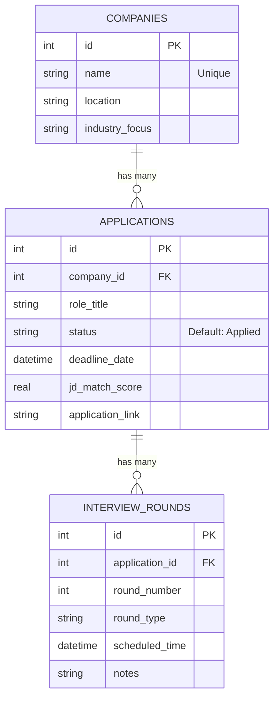

# Placement Tracking Agent — Bauhaus Neo-Brutalist Portal

A fully functional recruitment management web application built with **Python Flask**, **SQLite**, and **Gemini AI API**. Features robust application CRUD tracking, dynamic dashboard aggregates, structured comparative resume reviews, and a 48-hour deadline warning background thread scheduler.

Strictly styled according to a bold, asymmetric **Bauhaus Neo-Brutalist** visual system: high contrast solid color blocks, thick solid borders (2-4px), solid offsets, and Space Grotesk display typography.

---

## ⚡ Features

1. **Dashboard & Statistics:** Real-time bento cards showing active applications count, offers received, and 48-hour critical alerts. Includes an upcoming interactive timeline and main tracker table.
2. **Comprehensive Job CRUD Tracking:** Fully integrated management page allowing users to Add, Edit, and Delete job applications (Company, Role, Status, Deadline Date, Link). Automatically creates new corporate profile entries.
3. **Interview Funnel Manager:** Direct inline sub-drawer under each application card to track multi-stage interview rounds (Round Number, Stage Type, Date/Time, and Notes).
4. **Gemini AI Resume Matcher:** Dual-text comparison panel matching pasted resumes against Job Descriptions. Formulates structured prompts to retrieve compatibility scores, matching keywords, missing skills, and detailed bulleted revision actions in JSON.
5. **Direct Tracker Binding:** Automatically link Gemini Match scores back to database application rows with a simple dropdown selector in the analyzer.
6. **48h Background Thread Scheduler:** Independent background thread running every 60 seconds that scans the database. It prints high-contrast Neo-Brutalist ASCII alert boxes in the system console, and pushes warnings into a global queue that displays a flashing alert banner across the entire web interface.
7. **User-Friendly Key Fallback:** Dynamically input and clear your Gemini API Key directly inside the browser UI, securely cached in session state.

---

## 🛠️ Tech Stack
- **Backend:** Python 3 + Flask
- **Database:** SQLite 3 (Standard SQL + Cascading Deletes)
- **Styling:** Tailwind CSS (via CDN configuration) + Custom Neo-Brutalist override styles
- **AI Engine:** Google Gemini API (using the standard `google-generativeai` SDK)
- **Console Utilities:** `colorama` + ASCII Art blocks

---

## 🚀 Setup & Execution Guide

### 1. Install Dependencies
Ensure you are in the application root directory and run the command to install packages:
```bash
pip install -r requirements.txt
```

### 2. Configure Environment variables
Edit the `.env` file in the root directory to set your Flask session secret and Gemini API Key:
```env
FLASK_SECRET_KEY=your-brutalist-secret-key
GEMINI_API_KEY=AIzaSy... (Optional: can also be set in the Web UI!)
```

### 3. Initialize & Seed Database
The application automatically checks for the presence of the SQLite database (`placement.db`) on start. If it is not found, it runs `schema.sql` and populates the database using `seed.sql`.
*Note: Seed data is pre-configured with upcoming deadlines relative to current date (May 2026) to demonstrate the background scheduler instantly!*

### 4. Start the Application
Run the Flask server:
```bash
python app.py
```

Open your browser and navigate to:
```text
http://127.0.0.1:5000/
```

---

## 📈 Database Schema Structure

The database handles relational mapping through three cohesive tables:


All tables use cascading constraints (`ON DELETE CASCADE`), ensuring full database cleanliness on deletion.
